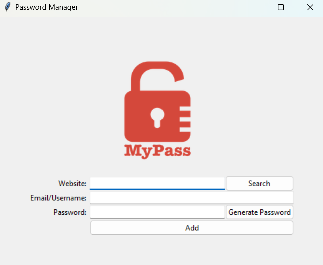

# Project Title

This is an application built by using python tkinter module mainly. Password manager helps you store your information so you will always have a backup incase you forget them!

## Features

- Saving and retrieving information back.
- Automated password generation system.
- The generated password will automatically copied to clipboard
- The information is stored in a ".json" format.

### Prerequisites

Before you begin, ensure you have met the following requirements:

- **Python**: You need Python installed on your system. This project was developed with Python 3.11+.
